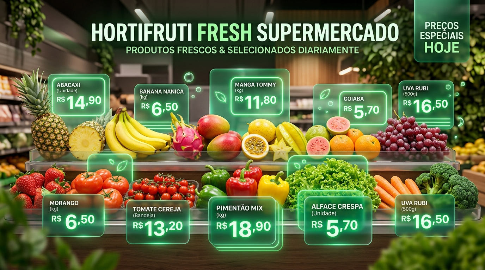

# 🛒 Mercado Fácil - Sistema Inteligente de Listas de Compras & Preços On-line

> Sistema web moderno, responsivo e em Português (pt-BR) para criação e gerenciamento de listas de compras de supermercado com cotação de preços em tempo real, comparador entre redes concorrentes e modo de compras in-store.



---

## 🚀 Principais Funcionalidades

- ⚡ **Cotação de Preços On-line em Tempo Real**: Consulta simulada de preços para mais de 50 produtos essenciais com atualização instantânea e indicadores de tendência (Subiu 📈, Baixou 📉, Estável ➡️).
- 🏪 **Comparador de Redes de Supermercados**: Compara automaticamente o valor total da sua lista entre redes como **Carrefour**, **Assaí Atacadista**, **Pão de Açúcar**, **Extra** e **Atacadão**, indicando o supermercado mais barato.
- 📋 **Gestão por Categorias**: Organização automática em *Hortifrúti, Carnes & Aves, Laticínios, Mercearia, Padaria, Limpeza, Bebidas e Higiene*.
- 🛒 **Modo Mercado (In-Store)**: Visão focada para uso em smartphones com cards táteis, marcação no carrinho e acompanhamento do limite de orçamento com alertas.
- 📊 **Gráficos & Analytics**: Gráfico de rosca para distribuição de gastos por categoria e gráfico de barras para comparação entre mercados.
- 📱 **Exportação & WhatsApp**: Formata e envia a lista de compras diretamente pelo WhatsApp ou exporta backup em formato JSON.
- 🌙 **Modo Escuro (Dark Mode) & Modo Claro**: Interface responsiva desenvolvida com CSS Glassmorphism e Google Fonts (Outfit & Inter).

---

## 📂 Estrutura do Projeto

```text
mercado_smart/
├── index.html       # Estrutura semântica e abas da aplicação
├── styles.css       # Design System, variáveis CSS, temas e glassmorphism
├── app.js           # Gerenciamento de estado, LocalStorage e gráficos
├── mock-prices.js   # Base de cotação e serviço de API on-line simulada
└── assets/
    └── banner.jpg   # Arte promocional e banner do sistema
```

---

## 🛠️ Como Executar Localmente

1. Clone ou baixe este repositório:
   ```bash
   git clone https://github.com/anamarsilva35-png/mercado-facil-lista-de-compras-inteligente.git
   ```
2. Abra a pasta do projeto.
3. Dê um duplo clique no arquivo `index.html` para abrir a aplicação diretamente em qualquer navegador web (Google Chrome, Microsoft Edge, Firefox, Safari).

---

## ☁️ Como Fazer o Deploy na Vercel

O projeto já está totalmente configurado com `vercel.json` e `.vercelignore` para rodar na Vercel com alta performance e cabeçalhos de segurança otimizados.

### Opção 1: Pelo GitHub (Recomendado)

1. Crie um repositório no seu [GitHub](https://github.com/new).
2. No terminal do seu projeto, vincule o repositório remoto e envie o código:
   ```bash
   git add .
   git commit -m "feat: configuracoes para deploy na vercel"
   git branch -M main
   git remote add origin https://github.com/SEU_USUARIO/NOME_DO_REPO.git
   git push -u origin main
   ```
3. Acesse [vercel.com](https://vercel.com) e faça login (pode ser com sua conta do GitHub).
4. Clique em **"Add New..."** > **"Project"**.
5. Selecione o repositório do projeto recém-criado.
6. A Vercel detectará automaticamente como projeto estático:
   - **Framework Preset**: *Other*
   - **Root Directory**: `./`
7. Clique no botão azul **"Deploy"**.
8. Em poucos segundos seu site estará no ar com HTTPS gratuito e URL oficial (ex: `mercado-facil.vercel.app`)!

### Opção 2: Pela Linha de Comando (Vercel CLI)

Se você tiver o Node.js instalado no seu computador:
```bash
npx vercel
```
Basta seguir as instruções na tela e fazer login para publicar imediatamente.

---

## 📄 Licença

Este projeto foi desenvolvido com a assistência do **Antigravity AI**.
